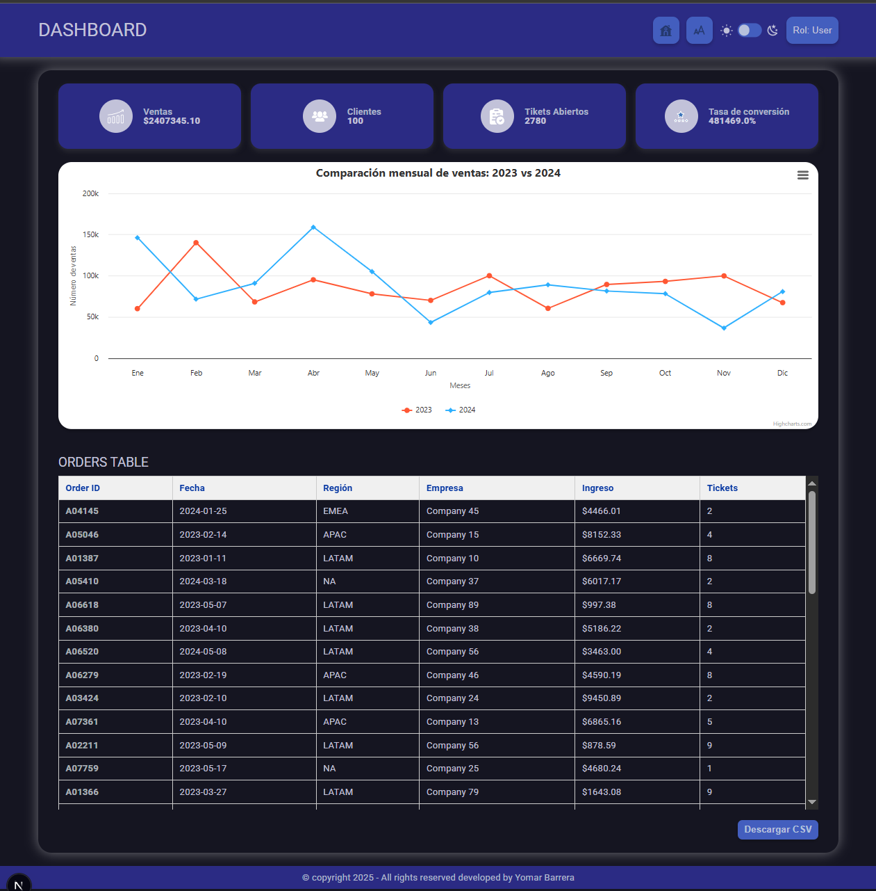
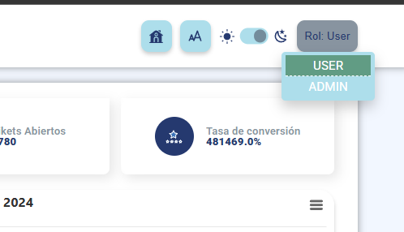
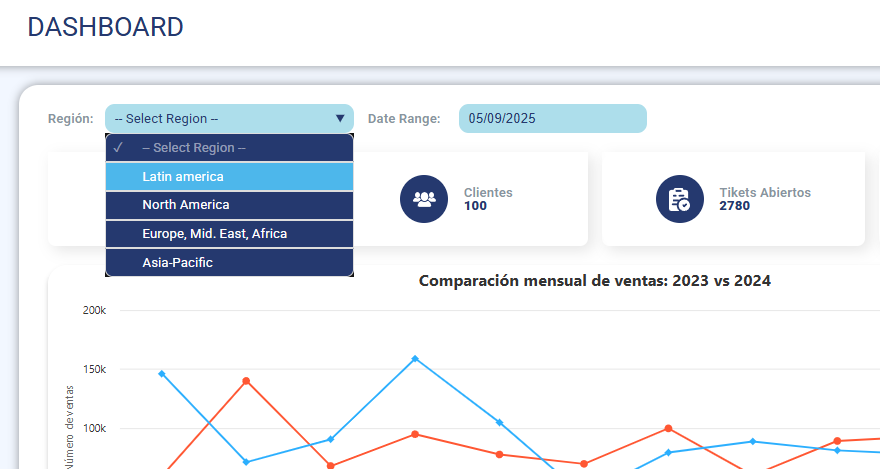
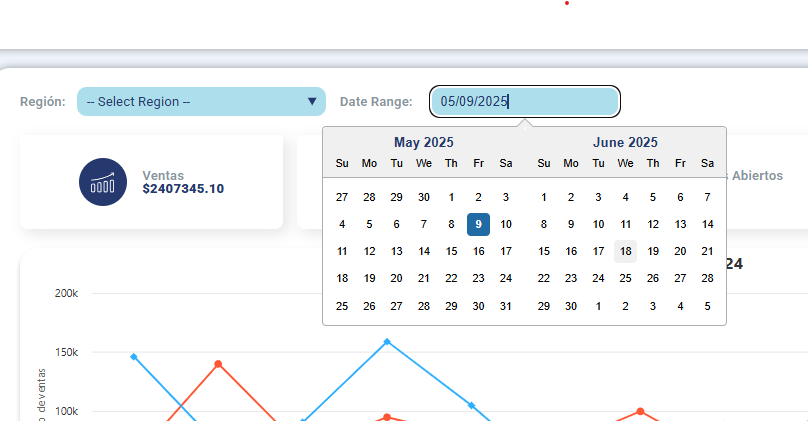
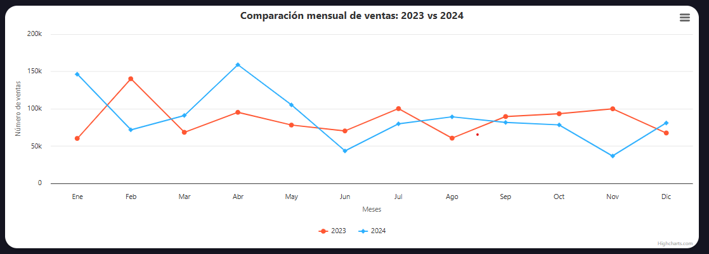

# 🚀 Dashboard Analítico

Este proyecto es una aplicación web construida con [Next.js](https://nextjs.org/), lista para despliegue en producción.

Diseñada como un dashboard para visualizar órdenes, métricas de ventas, filtros por región y fecha, y reportes en tiempo real mediante gráficos interactivos. Ideal para áreas de operaciones, logística o análisis comercial.

## 📦 Stack Tecnológico

- Next.js – Framework de React para SSR y SSG  
- React – Librería principal para UI  
- TypeScript – Tipado estático  
- SCSS Modules – Estilos encapsulados por componente  
- Highcharts – Gráficas interactivas  
- Docker – Contenedor de producción  

## ⚙️ Instalación Rápida en Local

1. Clona el repositorio:

```bash
git clone https://github.com/yomBarrera/dashboard-analitico
cd dashboard-analitico
```

2. Corre el script todo-en-uno para desarrollo:

```bash
npm run all-dev
```

Este script instalará dependencias y lanzará el servidor en modo desarrollo en http://localhost:3000

## 🐳 Despliegue en Producción con Docker

Este proyecto incluye un Dockerfile multietapa optimizado para generar una imagen ligera y ejecutable en cualquier entorno compatible con contenedores.

### ¿Qué hace este Dockerfile?

- Usa Node 22 en Alpine (liviano)  
- Instala dependencias con npm ci  
- Ejecuta npm run build para compilar la app Next.js  
- Expone el puerto 3000  
- Ejecuta la app con next start en modo producción  

### Cómo construir y ejecutar el contenedor

```bash
# Paso 1: Construir la imagen
docker build -t dashboard-proj .

# Paso 2: Ejecutar el contenedor en localhost:3000
docker run -p 3000:3000 dashboard-proj
```

## 📂 Estructura del Proyecto

```
dashboard-analitico/
├── pages/               # Páginas y rutas Next.js
├── public/              # Archivos estáticos
├── src/
│   ├── context/         # Contextos globales
│   ├── ui/components/   # Componentes reutilizables
│   ├── styles/          # Estilos SCSS modules
│   ├── types/           # Interfaces TypeScript
├── Dockerfile           # Contenedor para producción
├── package.json
├── tsconfig.json
```

## 🔁 Scripts útiles

| Comando             | Descripción                                   |
|---------------------|-----------------------------------------------|
| npm run start       | Ejecuta la app compilada en producción        |
| npm run all-dev     | Instalación + ejecución en modo desarrollo    |
| npm run dev         | Ejecuta Next.js en modo desarrollo            |
| npm run build       | Compila la app para producción                |

## 🌐 Variables de Entorno

Crea un archivo .env.local con tus variables necesarias:

```
NEXT_PUBLIC_API_URL=https://api.example.com
```

## Decisión Técnica: Uso de Context API con useReducer para manejo global de órdenes

*Fecha:* 2025-05-09  
*Estado:* Aprobada

### Contexto
Se requiere compartir el estado de órdenes (lista, filtros, métricas, paginación) entre múltiples vistas y componentes sin depender de props drilling.

### Decisión
Se utilizó Context API junto con useReducer y useMemo para encapsular la lógica de negocio de órdenes en un OrdersProvider. Este contexto expone:
- Estado global de órdenes.
- Filtros (fecha, región).
- Métricas calculadas (ingresos, clientes, etc.).
- Paginación con scroll infinito.
- Datos estructurados para Highcharts.

### Justificación
- Evita duplicar lógica en componentes.
- Centraliza reglas de negocio.
- Compatible con SSR y client-side rendering de Next.js.
- Escalable y extensible (por ejemplo, para paginación o mutaciones).

### Consecuencias
✅ Componentes más limpios  
✅ Estado global reutilizable  
⚠️ Ligeramente más complejo que useState  
⚠️ Puede requerir memoización para evitar renders innecesarios

### Alternativas consideradas
- Redux: se descartó por su complejidad y necesidad de configuración adicional.

## Decisión Técnica: Uso de Highcharts para visualización de ventas

*Fecha:* 2025-05-09  
*Estado:* Aprobada

### Contexto
El proyecto requiere una visualización clara y exportable de las ventas mensuales comparadas por año. Se necesita soporte para múltiples series, accesibilidad, exportación de gráficos y compatibilidad con React y SSR.

### Decisión
Se decidió utilizar la biblioteca [Highcharts](https://www.highcharts.com/) integrada a través del paquete highcharts-react-official para construir un gráfico de líneas que muestra las ventas mensuales por año.

### Justificación
- *Robustez*: Highcharts ofrece múltiples tipos de gráficas, soporte para zoom, leyendas dinámicas y exportación (PNG, JPEG, PDF, SVG).
- *Exportación*: Incluye módulo de exportación sin dependencias adicionales (útil para reportes).
- *Accesibilidad (a11y)*: Tiene módulo de accesibilidad listo para habilitar navegación por teclado y screen readers.
- *Personalización*: Permite configurar tooltips, estilos, ejes, series y más con precisión.
- *Compatibilidad*: Funciona correctamente con Next.js y SSR (en lazy load o client-side).

### Consecuencias
✅ Visualizaciones profesionales y exportables  
✅ Soporte completo para interacción y navegación  
⚠️ Tamaño de bundle mayor comparado con alternativas como Chart.js  
⚠️ Licencia comercial en proyectos cerrados de alto tráfico

## 📷 Capturas del Proyecto

### Vista general del dashboard oscuro



### Vista general del dashboard claro


### Vista Selector de roles 



### Filtro por fechas y regiones




### Gráfico de órdenes por año



## ✉️ Autor

Proyecto desarrollado por Yomar Barrera – https://github.com/yomBarrera
